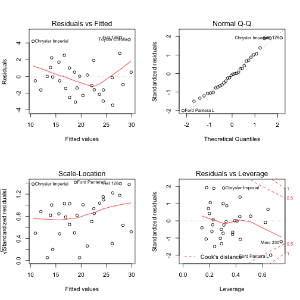
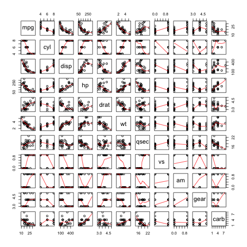

## Executive Summary

This paper seeks to address how a vehicle's transmission (automatic or manual) impacts that vehicles MPG.


```r
data(mtcars)
boxplot(mpg ~ am, data = mtcars, xlab = "Transmission", ylab = "MPG", main = "MPG by Transmission")
```

 

Given the above plot, it would seem that manual transmissions (labeled '1' above) have a higher MPG than automatic transmissions (labeled '0' above). 

The selected model for this analysis incorporates Transmission, Weight, and the interaction between the two as input variables upon on the predicted variable of MPG.


```r
fit3 <- lm(mpg ~ factor(am) * wt, data = mtcars)
fit3$coef
```

```
##    (Intercept)    factor(am)1             wt factor(am)1:wt 
##         31.416         14.878         -3.786         -5.298
```

The positive coeffecient of the manual transmission (14.878) indicates the manual transmissions have a positive effect on MPG (all else being equal). However, this is complicated by the interaction of Weight and Transmission. For each thousand pounds of weight, a manual transmission can expect an additional reduction in MPG in the amount of -5.298 (note that this is in addition to the -3.786 decrease in MPG per thousand pounds that affects both manual and automatic transmissions.

Thus, this model indicates that a manual transmission is more efficient up to a specific weight: 2,808 pounds. At this point, an automatic transmission is more efficient in terms of MPG


```r
plot(predict(fit3,mtcars) , mtcars$mpg, xlab = "Predicted MPG", ylab = "Actual MPG")
abline(a=0, b = 1, col = "red")
```

 

## Appendix

We start by first looking at the data:


```r
head(mtcars)
```

```
##                    mpg cyl disp  hp drat    wt  qsec vs am gear carb
## Mazda RX4         21.0   6  160 110 3.90 2.620 16.46  0  1    4    4
## Mazda RX4 Wag     21.0   6  160 110 3.90 2.875 17.02  0  1    4    4
## Datsun 710        22.8   4  108  93 3.85 2.320 18.61  1  1    4    1
## Hornet 4 Drive    21.4   6  258 110 3.08 3.215 19.44  1  0    3    1
## Hornet Sportabout 18.7   8  360 175 3.15 3.440 17.02  0  0    3    2
## Valiant           18.1   6  225 105 2.76 3.460 20.22  1  0    3    1
```

```r
str(mtcars)
```

```
## 'data.frame':	32 obs. of  11 variables:
##  $ mpg : num  21 21 22.8 21.4 18.7 18.1 14.3 24.4 22.8 19.2 ...
##  $ cyl : num  6 6 4 6 8 6 8 4 4 6 ...
##  $ disp: num  160 160 108 258 360 ...
##  $ hp  : num  110 110 93 110 175 105 245 62 95 123 ...
##  $ drat: num  3.9 3.9 3.85 3.08 3.15 2.76 3.21 3.69 3.92 3.92 ...
##  $ wt  : num  2.62 2.88 2.32 3.21 3.44 ...
##  $ qsec: num  16.5 17 18.6 19.4 17 ...
##  $ vs  : num  0 0 1 1 0 1 0 1 1 1 ...
##  $ am  : num  1 1 1 0 0 0 0 0 0 0 ...
##  $ gear: num  4 4 4 3 3 3 3 4 4 4 ...
##  $ carb: num  4 4 1 1 2 1 4 2 2 4 ...
```

```r
summary(mtcars)
```

```
##       mpg            cyl            disp             hp       
##  Min.   :10.4   Min.   :4.00   Min.   : 71.1   Min.   : 52.0  
##  1st Qu.:15.4   1st Qu.:4.00   1st Qu.:120.8   1st Qu.: 96.5  
##  Median :19.2   Median :6.00   Median :196.3   Median :123.0  
##  Mean   :20.1   Mean   :6.19   Mean   :230.7   Mean   :146.7  
##  3rd Qu.:22.8   3rd Qu.:8.00   3rd Qu.:326.0   3rd Qu.:180.0  
##  Max.   :33.9   Max.   :8.00   Max.   :472.0   Max.   :335.0  
##       drat            wt            qsec            vs       
##  Min.   :2.76   Min.   :1.51   Min.   :14.5   Min.   :0.000  
##  1st Qu.:3.08   1st Qu.:2.58   1st Qu.:16.9   1st Qu.:0.000  
##  Median :3.69   Median :3.33   Median :17.7   Median :0.000  
##  Mean   :3.60   Mean   :3.22   Mean   :17.8   Mean   :0.438  
##  3rd Qu.:3.92   3rd Qu.:3.61   3rd Qu.:18.9   3rd Qu.:1.000  
##  Max.   :4.93   Max.   :5.42   Max.   :22.9   Max.   :1.000  
##        am             gear           carb     
##  Min.   :0.000   Min.   :3.00   Min.   :1.00  
##  1st Qu.:0.000   1st Qu.:3.00   1st Qu.:2.00  
##  Median :0.000   Median :4.00   Median :2.00  
##  Mean   :0.406   Mean   :3.69   Mean   :2.81  
##  3rd Qu.:1.000   3rd Qu.:4.00   3rd Qu.:4.00  
##  Max.   :1.000   Max.   :5.00   Max.   :8.00
```

The variable 'am' indicates the cars transmission type where 0 indicates automatic and 1 indicates manual.

### Model 1:

The first model, below, simply conducts a linear regression using mpg as the outcome variable and a factorized tranmission type as the input variable. This model produces a low R-squared indicating that it does not adequately explain the variance.


```r
fit <- lm(mpg ~ factor(am), data = mtcars)
summary(fit)
```

```
## 
## Call:
## lm(formula = mpg ~ factor(am), data = mtcars)
## 
## Residuals:
##    Min     1Q Median     3Q    Max 
## -9.392 -3.092 -0.297  3.244  9.508 
## 
## Coefficients:
##             Estimate Std. Error t value Pr(>|t|)    
## (Intercept)    17.15       1.12   15.25  1.1e-15 ***
## factor(am)1     7.24       1.76    4.11  0.00029 ***
## ---
## Signif. codes:  0 '***' 0.001 '**' 0.01 '*' 0.05 '.' 0.1 ' ' 1
## 
## Residual standard error: 4.9 on 30 degrees of freedom
## Multiple R-squared:  0.36,	Adjusted R-squared:  0.338 
## F-statistic: 16.9 on 1 and 30 DF,  p-value: 0.000285
```

```r
par(mfrow = c(2, 2))
plot(fit)
```

 

### Model 2:

The second model builds upon the first but includes all available variables as input variables. While this model's R-squared is much higher than Model 1, explaining a larger portion of the variance, the complexity of the model (the inclusion of all the variables) is inefficient.


```r
fit2 <- lm(mpg ~ factor(am) + ., data = mtcars)
summary(fit2)
```

```
## 
## Call:
## lm(formula = mpg ~ factor(am) + ., data = mtcars)
## 
## Residuals:
##    Min     1Q Median     3Q    Max 
##  -3.45  -1.60  -0.12   1.22   4.63 
## 
## Coefficients: (1 not defined because of singularities)
##             Estimate Std. Error t value Pr(>|t|)  
## (Intercept)  12.3034    18.7179    0.66    0.518  
## factor(am)1   2.5202     2.0567    1.23    0.234  
## cyl          -0.1114     1.0450   -0.11    0.916  
## disp          0.0133     0.0179    0.75    0.463  
## hp           -0.0215     0.0218   -0.99    0.335  
## drat          0.7871     1.6354    0.48    0.635  
## wt           -3.7153     1.8944   -1.96    0.063 .
## qsec          0.8210     0.7308    1.12    0.274  
## vs            0.3178     2.1045    0.15    0.881  
## am                NA         NA      NA       NA  
## gear          0.6554     1.4933    0.44    0.665  
## carb         -0.1994     0.8288   -0.24    0.812  
## ---
## Signif. codes:  0 '***' 0.001 '**' 0.01 '*' 0.05 '.' 0.1 ' ' 1
## 
## Residual standard error: 2.65 on 21 degrees of freedom
## Multiple R-squared:  0.869,	Adjusted R-squared:  0.807 
## F-statistic: 13.9 on 10 and 21 DF,  p-value: 3.79e-07
```

```r
par(mfrow = c(2, 2))
plot(fit2)
```

 

We then look at pairwise plots for all variables against all other variables to gain a better understanding of how variables may interact with mpg.


```r
pairs(mtcars, panel = panel.smooth)
```

 

Transmission, Weight and MPG are isolated in the below pairwise plot as these appear to have the strongest interactions.


```r
pairs(mtcars[c("am","wt","mpg")], panel = panel.smooth)
```

 

### Model 3:

Using the information from the above, we now isolate and use Transmission, Weight and the interaction between the two as inputs for our third and final model. This model produces a higher R-squared than Model 2 and is simpler to both explain and understand.


```r
summary(fit3)
```

```
## 
## Call:
## lm(formula = mpg ~ factor(am) * wt, data = mtcars)
## 
## Residuals:
##    Min     1Q Median     3Q    Max 
## -3.600 -1.545 -0.533  0.901  6.091 
## 
## Coefficients:
##                Estimate Std. Error t value Pr(>|t|)    
## (Intercept)      31.416      3.020   10.40  4.0e-11 ***
## factor(am)1      14.878      4.264    3.49   0.0016 ** 
## wt               -3.786      0.786   -4.82  4.6e-05 ***
## factor(am)1:wt   -5.298      1.445   -3.67   0.0010 ** 
## ---
## Signif. codes:  0 '***' 0.001 '**' 0.01 '*' 0.05 '.' 0.1 ' ' 1
## 
## Residual standard error: 2.59 on 28 degrees of freedom
## Multiple R-squared:  0.833,	Adjusted R-squared:  0.815 
## F-statistic: 46.6 on 3 and 28 DF,  p-value: 5.21e-11
```

```r
par(mfrow = c(2, 2))
plot(fit3)
```

 
