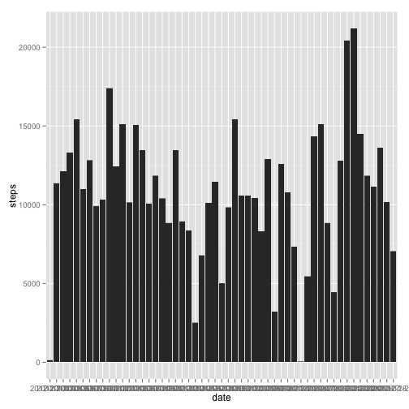

# Reproducible Research: Peer Assessment 1


## Loading and preprocessing the data


```r
library(ggplot2)
library(plyr)
library(gridExtra)
```

```
## Loading required package: grid
```

```r
rawdata <- read.csv("data/activity.csv", header = TRUE)
completedata <- rawdata[complete.cases(rawdata), ]
```


## What is mean total number of steps taken per day?


```r
ggplot(completedata, aes(x = date, y = steps)) + geom_bar(stat = "identity")
```

 

```r
summarybydate <- ddply(completedata, .(date), summarize, tot = sum(steps))
mean(summarybydate$tot)
```

```
## [1] 10766
```

```r
median(summarybydate$tot)
```

```
## [1] 10765
```


## What is the average daily activity pattern?


```r
ggplot(completedata, aes(x = interval, y = steps)) + stat_summary(fun.y = mean, 
    geom = "line")
```

 

```r
summarybyinterval <- ddply(completedata, .(interval), summarize, tot = mean(steps))
summarybyinterval[summarybyinterval$tot == max(summarybyinterval$tot), ]
```

```
##     interval   tot
## 104      835 206.2
```


## Imputing missing values

First, the number of incomplete cases is determined.

Next, the original dataset is merged with the summary by interval dataset. This provides, for each record, an additional column containing the average number of steps for that time interval across all the other days.

A new field is created, imputed, which at first merely replicates the steps field. Then, where the steps field is NA, the average steps for that interval are then used. This provides a complete data set within the imputed field.


```r
sum(!complete.cases(rawdata))
```

```
## [1] 2304
```

```r
mergeddata <- merge.data.frame(rawdata, summarybyinterval, by = "interval")
mergeddata$imputed <- mergeddata$steps
mergeddata[!complete.cases(mergeddata), "imputed"] <- mergeddata[!complete.cases(mergeddata), 
    "tot"]
ggplot(mergeddata, aes(x = date, y = imputed)) + geom_bar(stat = "identity")
```

 

```r
imputedsummarybydate <- ddply(mergeddata, .(date), summarize, tot = sum(imputed))
mean(imputedsummarybydate$tot)
```

```
## [1] 10766
```

```r
median(imputedsummarybydate$tot)
```

```
## [1] 10766
```


## Are there differences in activity patterns between weekdays and weekends?


```r
mergeddata$asdate <- as.Date(mergeddata$date, format = "%Y-%m-%d")
mergeddata$weekday[weekdays(mergeddata$asdate) == "Saturday" | weekdays(mergeddata$asdate) == 
    "Sunday"] <- "Weekend"
mergeddata$weekday[weekdays(mergeddata$asdate) != "Saturday" & weekdays(mergeddata$asdate) != 
    "Sunday"] <- "Weekday"
weekenddata <- mergeddata[mergeddata$weekday == "Weekend", ]
weekdaydata <- mergeddata[mergeddata$weekday == "Weekday", ]
weekendplot <- ggplot(weekenddata, aes(x = interval, y = imputed)) + stat_summary(fun.y = mean, 
    geom = "line") + labs(title = "Weekends", y = "Imputed Steps")
weekdayplot <- ggplot(weekdaydata, aes(x = interval, y = imputed)) + stat_summary(fun.y = mean, 
    geom = "line") + labs(title = "Weekdays", y = "Imputed Steps")
grid.arrange(weekendplot, weekdayplot)
```

 

